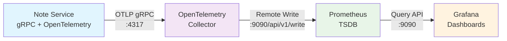
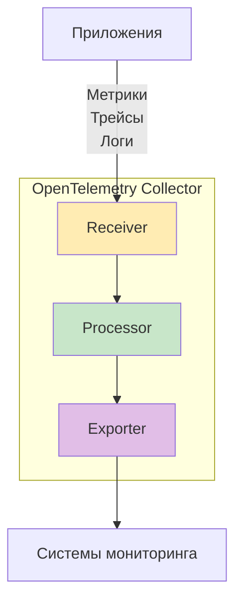
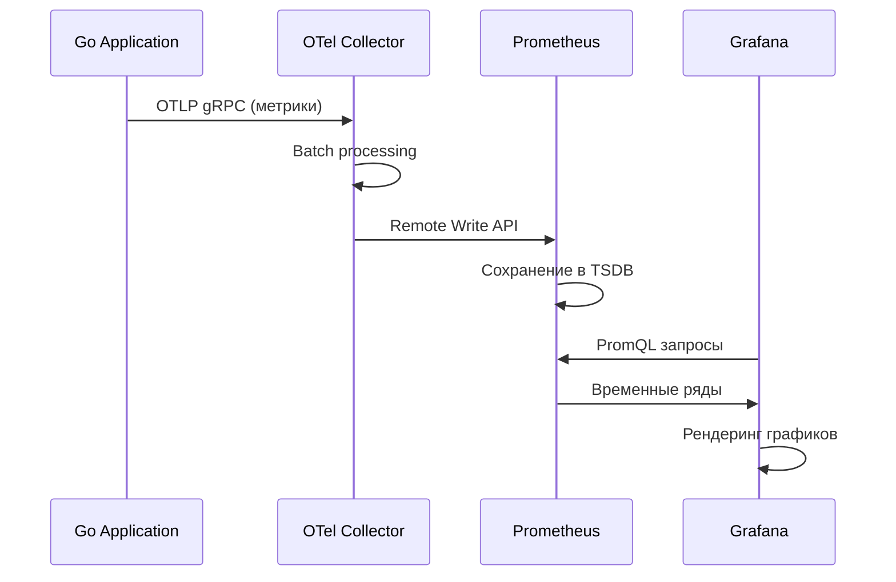

# Easy Metrics - OpenTelemetry Edition

Минималистичный пример использования OpenTelemetry для сбора метрик в gRPC сервисе с полной инфраструктурой мониторинга.

## 📋 Содержание

- [Архитектура](#архитектура)
- [OpenTelemetry Collector: Концепция](#opentelemetry-collector-концепция)
- [Метрики](#метрики)
- [Быстрый старт](#быстрый-старт)
- [PromQL: Базовый гид](#promql-базовый-гид)
- [Примеры запросов](#примеры-запросов)
- [Команды](#команды)

## Архитектура



### Компоненты системы:

1. **Note Service** (Go + gRPC + OpenTelemetry SDK)
   - Генерирует метрики с помощью OpenTelemetry Go SDK
   - Отправляет метрики через OTLP gRPC протокол

2. **OpenTelemetry Collector** (Контейнер otel/opentelemetry-collector-contrib)
   - Принимает метрики от приложения
   - Обрабатывает и агрегирует данные
   - Отправляет метрики в Prometheus

3. **Prometheus** (TSDB + Remote Write API)
   - Хранит временные ряды метрик
   - Предоставляет Query API для Grafana

4. **Grafana** (Визуализация)
   - Строит дашборды на основе данных из Prometheus
   - Предоставляет готовые графики производительности

## OpenTelemetry Collector: Концепция

### 🎯 Что такое OpenTelemetry Collector?

OpenTelemetry Collector — это **централизованный агент телеметрии**, который выступает посредником между вашими приложениями и системами мониторинга. Он решает проблему **vendor lock-in** и обеспечивает **единообразный сбор данных**.

### 🔄 Принципы работы



### 📦 Архитектура Collector

#### 1. **Receivers (Приемники)**
- **Функция**: Получение телеметрических данных
- **Протоколы**: OTLP, Prometheus, Jaeger, Zipkin, StatsD
- **В нашем проекте**: OTLP gRPC receiver на порту 4317

```yaml
receivers:
  otlp:
    protocols:
      grpc:
        endpoint: 0.0.0.0:4317  # Принимаем метрики от Go приложения
```

#### 2. **Processors (Обработчики)**
- **Функция**: Трансформация, фильтрация, обогащение данных
- **Типы**: batch, memory_limiter, attributes, resource
- **В нашем проекте**: batch processor для группировки метрик

```yaml
processors:
  batch:
    send_batch_size: 1000    # Группируем по 1000 метрик
    timeout: 10s             # Максимальное время ожидания
```

#### 3. **Exporters (Экспортеры)**
- **Функция**: Отправка данных в системы хранения
- **Назначения**: Prometheus, Grafana, Jaeger, AWS CloudWatch
- **В нашем проекте**: Prometheus Remote Write exporter

```yaml
exporters:
  prometheusremotewrite:
    endpoint: http://prometheus:9090/api/v1/write
```

#### 4. **Pipelines (Пайплайны)**
- **Функция**: Связывание receivers → processors → exporters
- **Типы**: metrics, traces, logs
- **В нашем проекте**: один пайплайн для метрик

```yaml
service:
  pipelines:
    metrics:
      receivers: [otlp]
      processors: [batch]
      exporters: [prometheusremotewrite]
```

### 🚀 Преимущества использования Collector

1. **Разделение обязанностей**
   - Приложение фокусируется на бизнес-логике
   - Collector управляет телеметрией

2. **Снижение нагрузки на приложение**
   - Batch processing снижает количество сетевых запросов
   - Асинхронная отправка не блокирует основной поток

3. **Централизованная конфигурация**
   - Одно место для настройки всей телеметрии
   - Легкое переключение между системами мониторинга

4. **Отказоустойчивость**
   - Retry механизмы при сбоях
   - Queue механизмы для временного хранения

### 🔗 Интеграция с Prometheus и Grafana



#### Remote Write vs Scraping

**Traditional Prometheus (Pull Model)**:
```
Prometheus ---> [HTTP GET /metrics] ---> Application
```

**OpenTelemetry + Remote Write (Push Model)**:
```
Application ---> [OTLP] ---> Collector ---> [Remote Write] ---> Prometheus
```

**Преимущества Push Model**:
- Не нужно настраивать service discovery
- Метрики доставляются в реальном времени
- Лучше работает с динамической инфраструктурой (Kubernetes, serverless)

## Метрики

Наша система собирает следующие метрики:

### 📊 Counter Metrics
```
my_space_grpc_my_app_requests_total
my_space_grpc_my_app_responses_total{status="success|error", method="..."}
```

### 📈 Histogram Metrics
```
my_space_grpc_my_app_histogram_response_time_seconds_bucket{le="...", status="..."}
my_space_grpc_my_app_histogram_response_time_seconds_count{status="..."}
my_space_grpc_my_app_histogram_response_time_seconds_sum{status="..."}
```

## Быстрый старт

### 1. Запуск инфраструктуры
```bash
task up
```

### 2. Запуск сервера
```bash
task run
```

### 3. Генерация нагрузки
```bash
# В отдельном терминале
while true; do task test:get; sleep 1; done
```

### 4. Доступ к интерфейсам
- **Prometheus**: http://localhost:9090
- **Grafana**: http://localhost:3000 (admin/admin)
- **OpenTelemetry Collector метрики**: http://localhost:8888/metrics

## PromQL: Базовый гид

### 🎯 Что такое PromQL?

**Prometheus Query Language (PromQL)** — это функциональный язык запросов для работы с временными рядами в Prometheus. Он позволяет:
- Выбирать и фильтровать метрики
- Выполнять математические операции
- Агрегировать данные по времени и лейблам
- Вычислять percentile и rate

### 📖 Основные концепции

#### 1. **Типы данных**

```promql
# Instant Vector - значение в конкретный момент времени
my_space_grpc_my_app_requests_total

# Range Vector - значения за диапазон времени
my_space_grpc_my_app_requests_total[5m]

# Scalar - числовое значение
100

# String - строковое значение (редко используется)
"error"
```

#### 2. **Селекторы метрик**

```promql
# Базовый селектор
my_space_grpc_my_app_requests_total

# Фильтрация по лейблам
my_space_grpc_my_app_responses_total{status="success"}

# Множественная фильтрация
my_space_grpc_my_app_responses_total{status="success", method="/note_v1.NoteV1/Get"}

# Регулярные выражения
my_space_grpc_my_app_responses_total{status=~"success|error"}

# Отрицание
my_space_grpc_my_app_responses_total{status!="success"}
```

#### 3. **Временные диапазоны**

```promql
# Последние 5 минут
[5m]

# Последний час
[1h]

# Последний день
[1d]

# Последняя неделя  
[7d]
```

### 🧮 Функции для разных типов метрик

#### 📊 **Counter (монотонно возрастающие)**

**Основная функция: `rate()`**
```promql
# RPS (requests per second) за последние 5 минут
rate(my_space_grpc_my_app_requests_total[5m])

# Общий RPS по всем методам
sum(rate(my_space_grpc_my_app_requests_total[5m]))

# RPS по статусам
sum by (status) (rate(my_space_grpc_my_app_responses_total[5m]))
```

**Альтернативы:**
```promql
# increase() - общее увеличение за период
increase(my_space_grpc_my_app_requests_total[1h])

# irate() - мгновенная скорость (последние 2 точки)
irate(my_space_grpc_my_app_requests_total[5m])
```

#### 📈 **Histogram (распределения)**

**Квантили (percentiles):**
```promql
# 95-й процентиль времени ответа
histogram_quantile(0.95, 
  sum by (le) (rate(my_space_grpc_my_app_histogram_response_time_seconds_bucket[5m]))
)

# 50-й процентиль (медиана) по статусам
histogram_quantile(0.5, 
  sum by (le, status) (rate(my_space_grpc_my_app_histogram_response_time_seconds_bucket[5m]))
)

# 99-й процентиль
histogram_quantile(0.99, 
  sum by (le) (rate(my_space_grpc_my_app_histogram_response_time_seconds_bucket[5m]))
)
```

**Среднее время:**
```promql
# Среднее время ответа
rate(my_space_grpc_my_app_histogram_response_time_seconds_sum[5m]) / 
rate(my_space_grpc_my_app_histogram_response_time_seconds_count[5m])
```

#### 📉 **Gauge (текущие значения)**

```promql
# Последнее значение
process_resident_memory_bytes

# Среднее за период
avg_over_time(process_resident_memory_bytes[5m])

# Максимальное за период
max_over_time(process_resident_memory_bytes[5m])
```

### 🔧 Агрегационные функции

```promql
# Сумма
sum(rate(my_space_grpc_my_app_requests_total[5m]))

# Среднее
avg(rate(my_space_grpc_my_app_requests_total[5m]))

# Максимум
max(rate(my_space_grpc_my_app_requests_total[5m]))

# Минимум
min(rate(my_space_grpc_my_app_requests_total[5m]))

# Количество
count(rate(my_space_grpc_my_app_requests_total[5m]))
```

### 📊 Группировка и агрегация

```promql
# Группировка по лейблу
sum by (status) (rate(my_space_grpc_my_app_responses_total[5m]))

# Группировка по нескольким лейблам
sum by (status, method) (rate(my_space_grpc_my_app_responses_total[5m]))

# Исключение лейблов из группировки
sum without (instance) (rate(my_space_grpc_my_app_responses_total[5m]))
```

### ⚡ Математические операции

```promql
# Сложение
rate(my_space_grpc_my_app_requests_total[5m]) + 1

# Умножение
rate(my_space_grpc_my_app_requests_total[5m]) * 60

# Деление (процент ошибок)
sum(rate(my_space_grpc_my_app_responses_total{status="error"}[5m])) / 
sum(rate(my_space_grpc_my_app_responses_total[5m])) * 100
```

## Примеры запросов

### 🚦 **Мониторинг производительности**

```promql
# 1. RPS входящих запросов
rate(my_space_grpc_my_app_requests_total[5m])

# 2. RPS ответов с разбивкой по статусам
sum by (status) (rate(my_space_grpc_my_app_responses_total[5m]))

# 3. Процент ошибок
sum(rate(my_space_grpc_my_app_responses_total{status="error"}[5m])) / 
sum(rate(my_space_grpc_my_app_responses_total[5m])) * 100

# 4. 95-й процентиль времени ответа
histogram_quantile(0.95, 
  sum by (le, status) (rate(my_space_grpc_my_app_histogram_response_time_seconds_bucket[5m]))
)

# 5. Среднее время ответа по методам
sum by (method) (rate(my_space_grpc_my_app_histogram_response_time_seconds_sum[5m])) / 
sum by (method) (rate(my_space_grpc_my_app_histogram_response_time_seconds_count[5m]))
```

### 📈 **Алертинг (для настройки алертов)**

```promql
# Высокий процент ошибок (> 5%)
sum(rate(my_space_grpc_my_app_responses_total{status="error"}[5m])) / 
sum(rate(my_space_grpc_my_app_responses_total[5m])) > 0.05

# Медленные запросы (95-й процентиль > 1 секунды)
histogram_quantile(0.95, 
  sum by (le) (rate(my_space_grpc_my_app_histogram_response_time_seconds_bucket[5m]))
) > 1

# Низкий RPS (< 1 RPS за 5 минут)
sum(rate(my_space_grpc_my_app_requests_total[5m])) < 1
```

### 🔍 **Детальный анализ**

```promql
# Топ-3 самых медленных методов
topk(3, 
  sum by (method) (rate(my_space_grpc_my_app_histogram_response_time_seconds_sum[5m])) / 
  sum by (method) (rate(my_space_grpc_my_app_histogram_response_time_seconds_count[5m]))
)

# Количество запросов за последний час
increase(my_space_grpc_my_app_requests_total[1h])

# Сравнение текущего RPS с часом назад
rate(my_space_grpc_my_app_requests_total[5m]) / 
rate(my_space_grpc_my_app_requests_total[5m] offset 1h)
```

## Команды

### Основные команды
```bash
task proto:gen         # Генерация protobuf файлов
task up                # Поднять контейнеры мониторинга  
task down              # Остановить контейнеры
task run               # Запустить gRPC сервер
```

### Команды разработки
```bash
task format            # Форматирование кода
task lint              # Линтинг кода
task deps:update       # Обновление зависимостей
```

### Тестирование
```bash
task test:get          # Тест получения заметки
task test:all          # Запуск всех тестов
```

## 🎛️ Структура проекта

```
easy_metrics/
├── api/
│   ├── buf.gen.yaml          # Конфигурация генерации buf
│   ├── buf.yaml              # Линтинг правила buf
│   └── note_v1/
│       └── note.proto        # gRPC API определение
├── cmd/grpc_server/
│   └── main.go              # Основной сервер
├── internal/
│   ├── interceptor/
│   │   └── metrics.go       # gRPC интерцептор для метрик
│   └── metric/
│       └── metrics.go       # OpenTelemetry метрики
├── pkg/proto/               # Сгенерированные Go файлы
├── docker-compose.yaml      # Инфраструктура мониторинга
├── otel-collector-config.yaml  # Конфигурация OTel Collector
├── prometheus.yml           # Конфигурация Prometheus
├── grafana_dashboard.json   # Готовый дашборд Grafana
└── Taskfile.yaml           # Команды сборки и развертывания
```

---

**🚀 Готово к использованию!** Теперь у вас есть полноценная система мониторинга с современными инструментами OpenTelemetry.