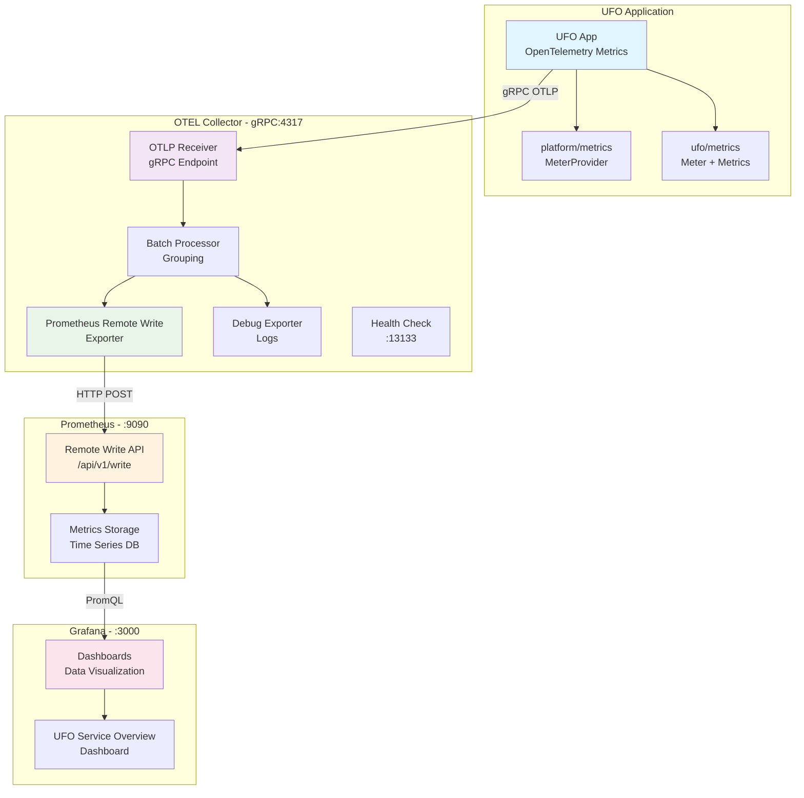

# Система мониторинга с OpenTelemetry, Prometheus и Grafana

Данный проект демонстрирует полную систему сбора и мониторинга метрик с использованием современного стека: OpenTelemetry Collector, Prometheus и Grafana.

## Архитектура системы



**Поток данных:**
1. UFO App собирает метрики через OpenTelemetry SDK
2. Метрики отправляются в OTEL Collector по gRPC (порт 4317)
3. Collector батчует метрики и отправляет в Prometheus через Remote Write API
4. Grafana визуализирует данные из Prometheus через PromQL запросы

### Компоненты системы

1. **UFO gRPC сервис** - простое приложение, генерирующее метрики
2. **OpenTelemetry Collector** - универсальный агент для сбора телеметрии
3. **Prometheus** - система мониторинга и база данных временных рядов
4. **Grafana** - платформа для визуализации и аналитики

## Быстрый старт

### Шаг 1: Генерация конфигурации

```bash
task env:generate
```

Эта команда:
- Создает `.env` файлы из шаблонов для всех сервисов
- Генерирует конфигурационные файлы из шаблонов
- Подставляет переменные окружения во все необходимые места

### Шаг 2: Запуск системы мониторинга

```bash
cd deploy/compose/core
docker-compose up -d
```

### Шаг 3: Запуск UFO приложения (локально)

```bash
go run ufo/cmd/main.go
```

### Шаг 4: Проверка работы

- **Prometheus**: http://localhost:9090
- **Grafana**: http://localhost:3000 (admin/admin)
- **UFO App**: gRPC на порту 50051

## Использование системы

### Генерация метрик

Отправляйте запросы к UFO сервису для генерации метрик:

```bash
# Создание наблюдения UFO
bin/grpcurl -plaintext -d '{
  "info": {
    "location": "Москва",
    "description": "Светящийся диск в небе",
    "color": "белый",
    "sound": false,
    "duration_seconds": 120
  }
}' localhost:50051 ufo.v1.UFOService/Create

# Анализ наблюдения
bin/grpcurl -plaintext -d '{
  "uuid": "12345678-1234-1234-1234-123456789abc"
}' localhost:50051 ufo.v1.UFOService/AnalyzeSighting
```

### Доступные метрики

UFO приложение экспортирует следующие метрики:

- `ufo_requests_total` - общее количество запросов с метками method/status
- `ufo_sightings_total` - общее количество зарегистрированных наблюдений
- `ufo_analysis_requests_total` - количество запросов на анализ
- `ufo_analysis_duration_seconds` - время выполнения анализа

## Конфигурация системы

### Структура переменных окружения

Все переменные централизованы в `deploy/env/.env` и используют префиксы:

```bash
# OpenTelemetry Collector
OTEL_GRPC_PORT=4317
OTEL_HTTP_PORT=4318
OTEL_BATCH_SIZE=1000

# Prometheus  
PROMETHEUS_HOST=prometheus
PROMETHEUS_PORT=9090
PROMETHEUS_EVALUATION_INTERVAL=15s

# Grafana
GRAFANA_PORT=3000
GRAFANA_ADMIN_USER=admin
GRAFANA_ADMIN_PASSWORD=admin
```

### Автоматическая генерация конфигурации

Команда `task env:generate` автоматически:

1. Генерирует `.env` файлы для каждого сервиса
2. Создает конфигурации из шаблонов:
   - `otel-collector-config.yaml` - конфигурация OpenTelemetry
   - `prometheus.yml` - конфигурация Prometheus  
   - `prometheus.yml` - datasource для Grafana

### Кастомизация конфигурации

1. Отредактируйте переменные в `deploy/env/.env`
2. Запустите `task env:generate` для применения изменений
3. Перезапустите сервисы: `docker-compose restart`

## Мониторинг и отладка

### Проверка здоровья сервисов

```bash
# Prometheus
curl http://localhost:9090/-/healthy

# Grafana
curl http://localhost:3000/api/health

# OpenTelemetry Collector
curl http://localhost:8888/metrics
```

### Полезные команды

```bash
# Просмотр логов
docker-compose logs -f prometheus
docker-compose logs -f grafana
docker-compose logs -f otel-collector

# Проверка конфигурации Prometheus
curl http://localhost:9090/api/v1/status/config

# Перезагрузка конфигурации Prometheus
curl -X POST http://localhost:9090/-/reload
```

## Доступные Taskfile команды

- `task env:generate` - генерация всех конфигураций
- `task env:install-envsubst` - установка утилиты envsubst
- `task build` - сборка UFO приложения
- `task run` - запуск UFO приложения

## Troubleshooting

### Проблема: Переменные не подставляются

**Решение**: Убедитесь, что запускали `task env:generate` после изменения `.env`

### Проблема: Prometheus не видит метрики

**Решение**: 
1. Проверьте, что UFO приложение запущено
2. Убедитесь, что порты доступны
3. Проверьте конфигурацию в `prometheus.yml`

### Проблема: Grafana не показывает данные

**Решение**:
1. Проверьте datasource в Grafana
2. Убедитесь, что в Prometheus есть данные
3. Проверьте настройки времени в дашбордах

## Расширение системы

### Добавление нового сервиса

1. Создайте шаблон `.env` в `deploy/env/`
2. Добавьте переменные в основной `.env`
3. Обновите `generate-env.sh` скрипт
4. Добавьте scrape_config в Prometheus

### Добавление кастомных метрик

1. Зарегистрируйте метрики в коде приложения
2. Убедитесь, что они экспортируются на `/metrics`
3. Prometheus автоматически их подберет

## Архитектурные принципы

- **Централизованная конфигурация** - все настройки в одном месте
- **Автоматическая генерация** - минимум ручных действий
- **Изоляция сервисов** - каждый компонент имеет свою конфигурацию
- **Наблюдаемость** - все компоненты мониторятся
- **Масштабируемость** - легко добавить новые сервисы 